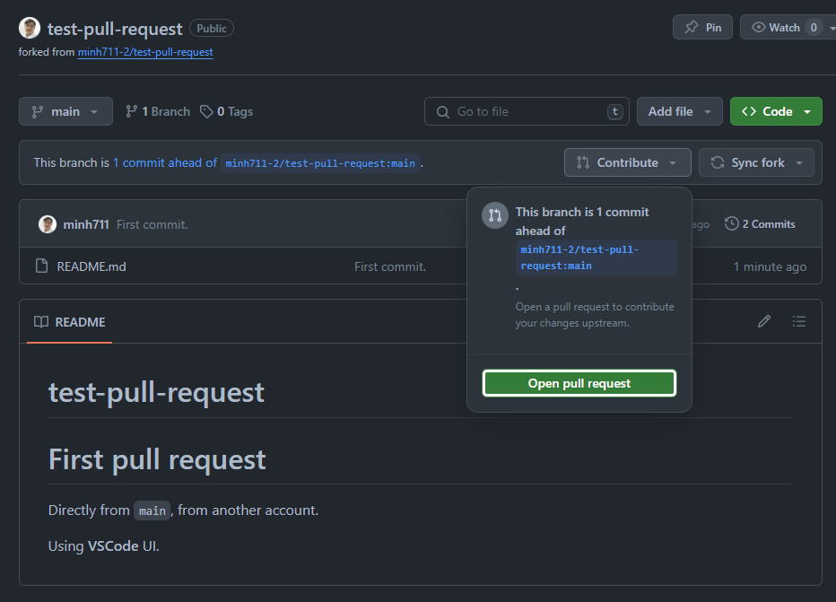
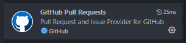
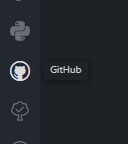
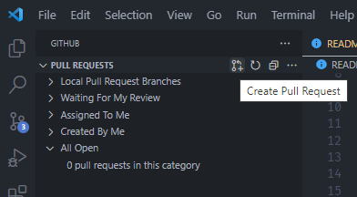
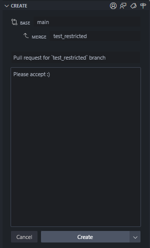

# test-pull-request

# First pull request

Directly from `main`, from another account.

Using **VSCode** UI.

Need a **fork**.

Now it has a option:




# Pull request from restricted branch

Is it the same as `main` branch when other contributors push their code?

When trying to `git push`, we will get a error message:

```bash
remote: error: Changes must be made through a pull request.
```

In this case, we can use `GitHub Pull Requests` extension:



After installing, it will appear on the left sidebar:



Then click `Create Pull Request`:



Then fulfill the information:



But seem like it impossible to create a pull request directly from a branch, may
be it should be folk to some other branch first.

This is a unnecessary line!
